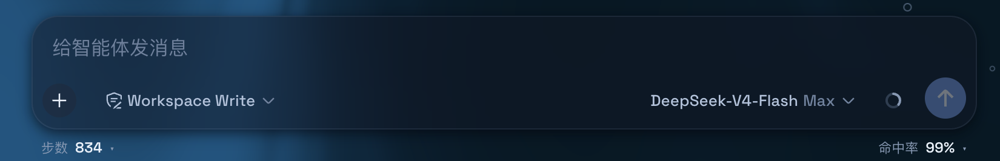
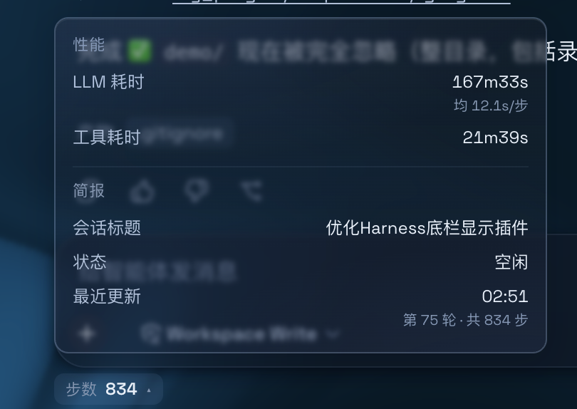
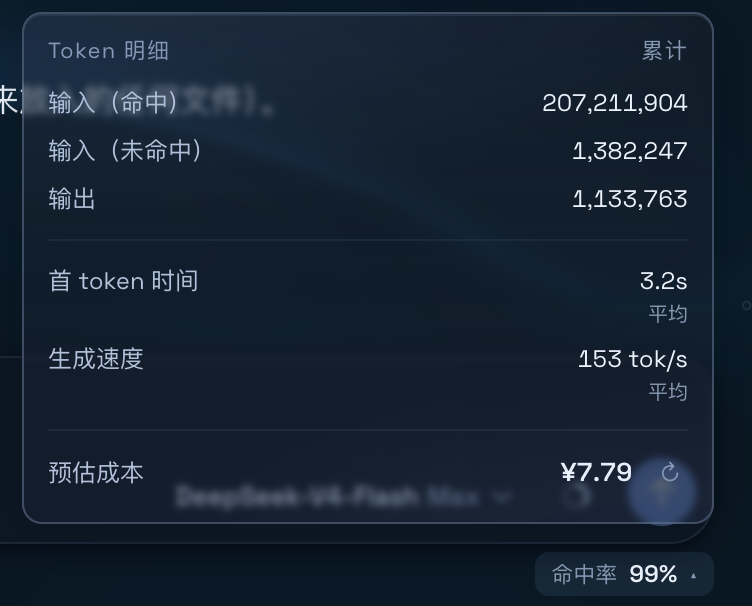
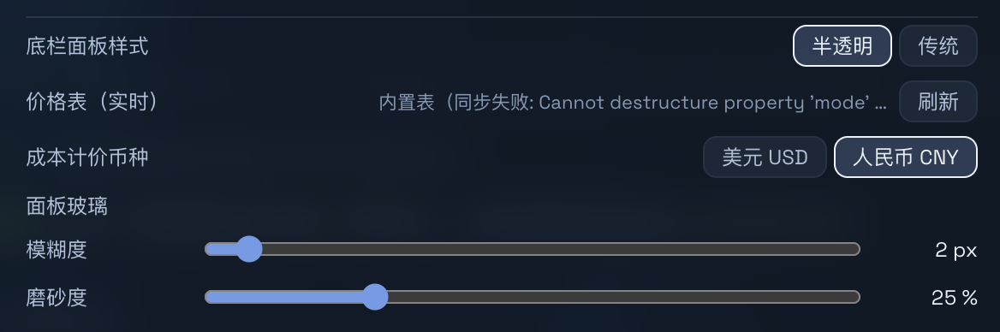
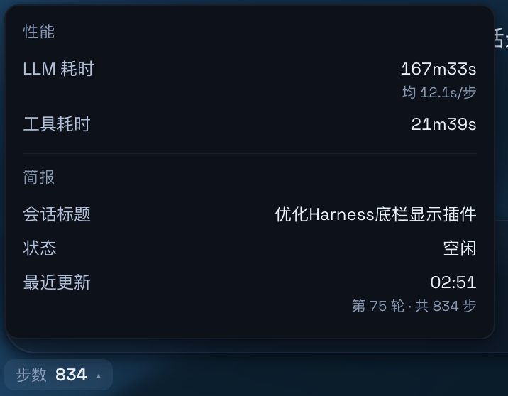
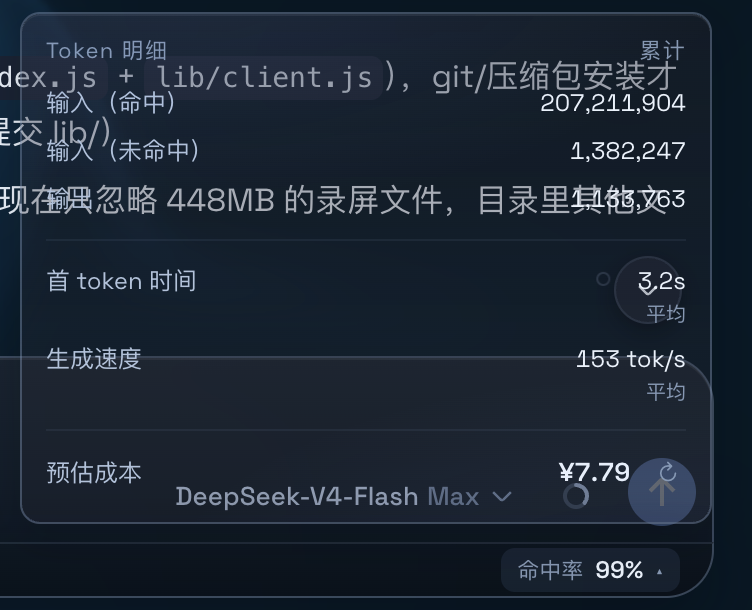
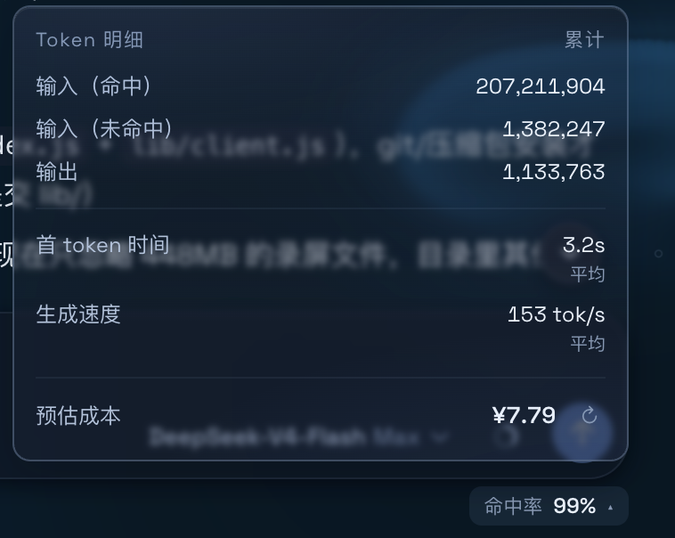

# Simple Dock — DSH 底栏统计插件

替换 DeepSeek Harness 网页端底栏的官方统计行，改成**左右双区、点击展开明细**的交互式统计坞。深浅色自适应，不依赖任何其他插件。

## 安装

```sh
./install.sh    # macOS / Linux：链接到 profile + 注册 bundle
```

然后**重启 DSH**（或刷新 Web 界面）生效。卸载：`./uninstall.sh`。

安装后会出现在 `设置 → 插件`（Simple Dock 卡片，可开关），设置项在 `设置 → 通用设置`。

## 功能

收起时为一行：左 `步数 N`、右 `命中率 X%`；点击左右区域分别展开明细面板。

| 说明 | 效果 |
|---|---|
| **收起状态**：`步数 N` ｜ `命中率 X%`，点击展开、点外部自动关闭 |  |
| **左面板**：**性能**（LLM 耗时：总计 + 均/步；工具耗时：次数 + 均/次）＋ **简报**（会话标题、状态、最近更新） |  |
| **右面板**：**Token 明细**（输入命中/未命中、输出）＋ 首 token 时间、生成速度 ＋ **预估成本**（单行「预估成本 金额 ↻」） |  |

## 设置（`设置 → 通用设置`）

| 说明 | 效果 |
|---|---|
| **底栏面板样式**：半透明（玻璃）/ 传统（实底）<br>**面板玻璃**：模糊度 0–40 px、磨砂度 0–100% 滑杆，拖动实时生效<br>**成本计价币种**：美元 USD / 人民币 CNY<br>**价格表（实时）**：models.dev 同步（1h 缓存，可手动刷新），失败回退内置表 |  |
| **传统模式**：实底背景与页面主背景一致，深浅主题自适应 |  |

## 其他

- 面板弹出时自动避让「回到底部」按钮；键盘可操作（Enter/空格）
- 成本按会话缓存：打开秒显旧值，后台每小时自动刷新，也可点「↻」手动刷新
- 非 DeepSeek 模型不显示预估费用

## 与 DSH-Transparent-UI-Plugin（Aqua 透明玻璃主题）并用

> <https://github.com/WYH66666666/DSH-Transparent-UI-Plugin>

同时启用时，需把 Aqua 的模式设为**兼容模式**（`设置 → 通用设置 → 外观 → 模式`）才能拥有面板模糊效果。

| 说明 | 效果 |
|---|---|
| **漂浮玻璃**模式：布局被重排成悬浮玻璃卡片，Simple Dock 面板的模糊失效 |  |
| **兼容模式**：保持原版排版，Simple Dock 面板的模糊正常 |  |

停止插件即恢复官方底栏，无残留。

## 构建与结构

```sh
node build.js    # 生成 lib/index.js（node 半区）+ lib/client.js（浏览器 bundle），构建即语法校验 + 冒烟测试
```

```
simple-dock/                # bundle 包（@deepseek-ai/dsh-client-ui-simple-dock）
├── src/
│   ├── index.js            #   node 半区（空 apply，纯 UI 插件）
│   └── client/             #   浏览器半区：prices / core / components / index + styles.css
├── lib/                    # 构建产物（client.js = __ModuleLoader__.load 格式）
├── build.js                # 零依赖打包器
├── install.sh / uninstall.sh
├── assets/ + demo/         # 截图与录屏
└── dynamic/                # 旧版动态插件（会话级，已不再需要）
```
